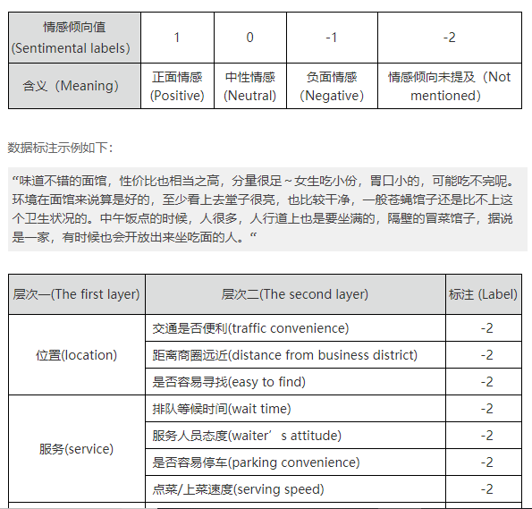
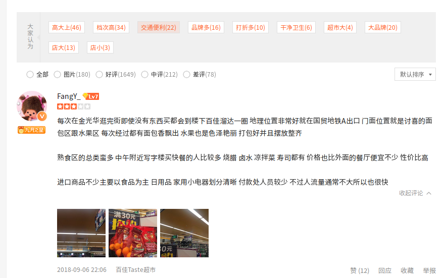
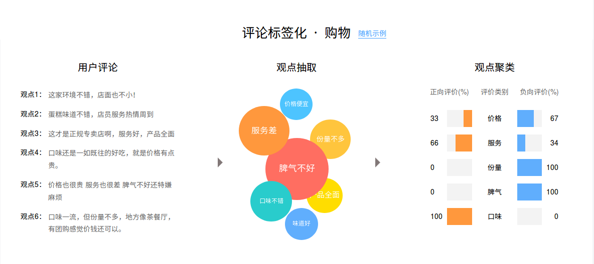
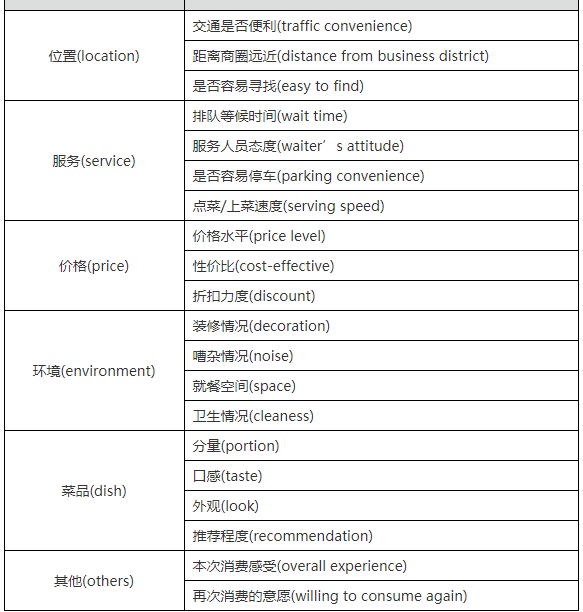

# 2018-10-11组会

## 回顾

工作分为两个部分：

- 第一个是从新闻资讯中抽取用户关注的服务质量信息
    - 扩展了数据源（36kr，新零售家，华尔街见闻，中国零售网）
    - 对数据标注规则进行了调整
    - 标数据
- 第二个是从用户评论中抽取服务质量信息（群体性的分析）

目前是从新零售领域入手去做，但提出的方法需要能够扩展至其他领域

## 第二部分

目前大部分新闻资讯都是从服务提供商的视角出发进行客观论述，其内容中涉及到用户关注的服务质量点比较少，主要有：

- 服务时效性
- 服务准确性
- 服务操作便捷性
- 服务覆盖的区域范围
- 服务覆盖的时间范围
- 服务覆盖品类丰富程度
- 合作商覆盖度
- 包装材质

而评论中蕴涵的才是更加直观的用户视角关注点，特别在新零售领域，用户线下消费的体验中包含了大量内容，这些都是新闻资讯中少有体现的。

希望实现：  
提出一个方法，从一段时间内某个服务的用户评论中自动抽取出 <服务质量标签，用户情感倾向(%)>，进一步分析服务质量变化。

### 思考

- 目前已有方法的效果
    - 从目前官方提供的标签来看，粗粒度，可能会忽略很多对我们有用的内容
    - 实现标签 -> 服务质量，服务质量需要预先定义？

        
        

    

- 如果要自己进行方法改造，抽取得到更加细粒度的标签
    - 一些可能有用的数据集
        - 9月美团地域-门店层级食品安全差评数据(未标注)；  
        - 美团AI challenger 15w条用户评论数据，预先定义了6大类20个细粒度要素，并且标注了相应的情感倾向
        

## 反馈

1. 现阶段：考虑软服务机器人，养老服务，老人指定几个关注的质量点，相当于有几类，然后对用现有方法抽取出的标签进行归类
2. 以后：
    - 两个方向：定义用户关注的服务质量层次结构树；从文本中还原出标签对应的服务质量，即标签的主语
    - 出现新的服务质量点，或者用户关注点成长，应该如何处理？
    - 之前考虑的那些价格、促销相关的是不是也要纳入其中？
    - 抽取出服务质量之后，要从时序上对其变化进行分析，定性的服务质量如何进行定量的变化分析？
    - 最后用于用户可容忍范围的服务推荐
